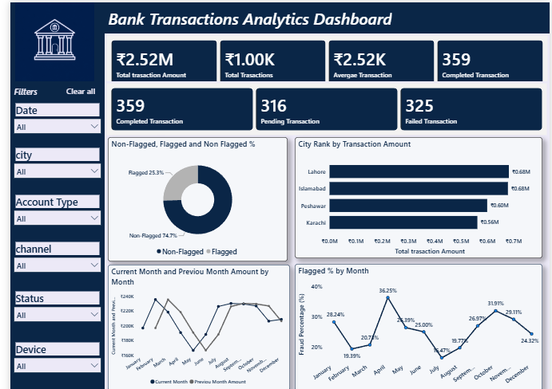
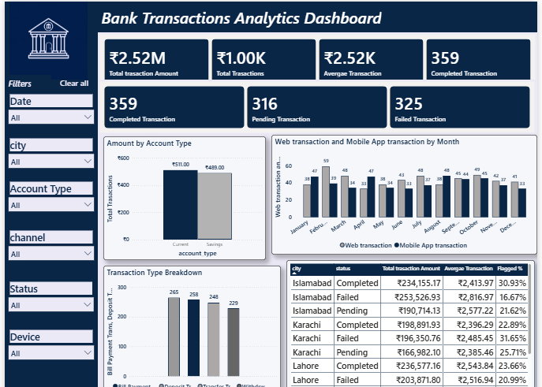

# 🏦 Bank Transaction Analytics Dashboard

An interactive Power BI dashboard analyzing 1,000+ bank transactions across multiple cities, account types, and channels — with a strong focus on fraud detection and transaction health monitoring.

---

## 📊 Dashboard Preview

### Overview Page

### Details Page

---

## 📌 Project Overview

This dashboard provides a real-time view of bank transaction performance, helping stakeholders track transaction volume, monitor fraud risk, and understand customer behavior across channels and account types. Built entirely in Power BI, the project demonstrates end-to-end analytics skills — from raw data to a polished, decision-ready dashboard.

---

## 🎯 Business Questions Answered

- What is the total transaction volume and value?
- How many transactions are completed, pending, or failed?
- What percentage of transactions are flagged as fraud, and how does it trend monthly?
- Which cities generate the highest transaction amounts?
- How does the current month's transaction amount compare to the previous month?
- Which account type and channel are used the most?
- What is the transaction pattern by day of week and transaction type?
- What is the average transaction amount and fraud rate, by city and status?

---

## 🛠️ Tools & Techniques

- **Power BI** — Data modeling, Power Query, DAX, interactive dashboard design
- **Custom Calendar Table** — Built from scratch to support time-intelligence calculations
- **20+ DAX Measures**, including:
  - Aggregations: `SUM`, `AVERAGE`, `COUNTROWS`
  - Conditional logic: `CALCULATE`, `DIVIDE`
  - Ranking: `RANKX`
  - Time intelligence: custom `EOMONTH`-based logic for accurate "current month vs previous month" calculations that stay correct regardless of filter context
- **Power Query** — Data cleaning and data type validation
- **Data Modeling** — Relationship between the Calendar table and the transactions table

---

## 📈 Dashboard Pages

### 1. Overview
- KPI summary cards: Total Transaction Amount, Total Transactions, Average Transaction Amount, Completed/Pending/Failed Transactions
- Fraud vs Non-Fraud donut chart with fraud % monthly trend
- City-wise transaction ranking (RANKX)
- Current vs Previous Month transaction amount trend

### 2. Details
- Amount by Account Type (Current vs Savings)
- Web vs Mobile App transactions by month
- Transaction Type breakdown (Bill Payment, Deposit, Transfer, Withdrawal)
- Full detail table: City, Status, Total Amount, Average Transaction Amount, Fraud %

Both pages include a shared filter panel — Date, City, Account Type, Channel, Status, and Device — with a "Clear All" reset button for easy exploration.

---

## 📁 Dataset

- **Source:** Kaggle
- **Size:** 1,000 rows, 13 columns
- **Columns:** `transaction_id`, `date`, `customer_id`, `account_type`, `transaction_type`, `amount`, `currency`, `channel`, `device`, `city`, `status`, `balance_after`, `fraud_flag`

---

## 🚀 Key Takeaways

This project strengthened my skills in advanced DAX (especially time-intelligence patterns that go beyond simple filter context), dashboard UX design, and translating raw transactional data into a fraud-aware, decision-ready analytics tool — directly relevant to Data Analyst, MIS, and Reporting Analyst roles.

---

## 📬 Contact

Feel free to connect or reach out for freelance/full-time Data Analyst opportunities.
